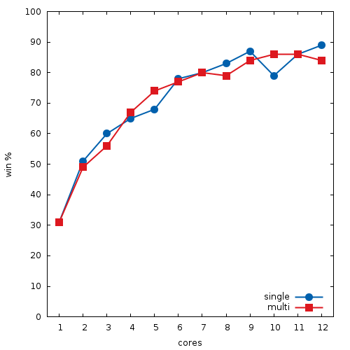

# lockfree-mcts-cpp [](https://travis-ci.org/lake4790k/lockfree-mcts-cpp)
General lockfree Monte Carlo Tree Search implementation in Cpp

### Results

Result from the included n x n x k TicTacToe game on an `i7 5820k`



The baseline player thinks 400 iterations vs a singlethreaded player that thinks n * 400 iterations and a multithreaded player that thinks 400 iterations on each thread.

```./benchmark 8 6 200 400```

### References

[1] [A Lock-free Multithreaded Monte-Carlo Tree Search Algorithm](
https://webdocs.cs.ualberta.ca/~mmueller/ps/enzenberger-mueller-acg12.pdf)

[2] [Mastering the game of Go with deep neural networks and tree search](http://willamette.edu/~levenick/cs448/goNature.pdf)
